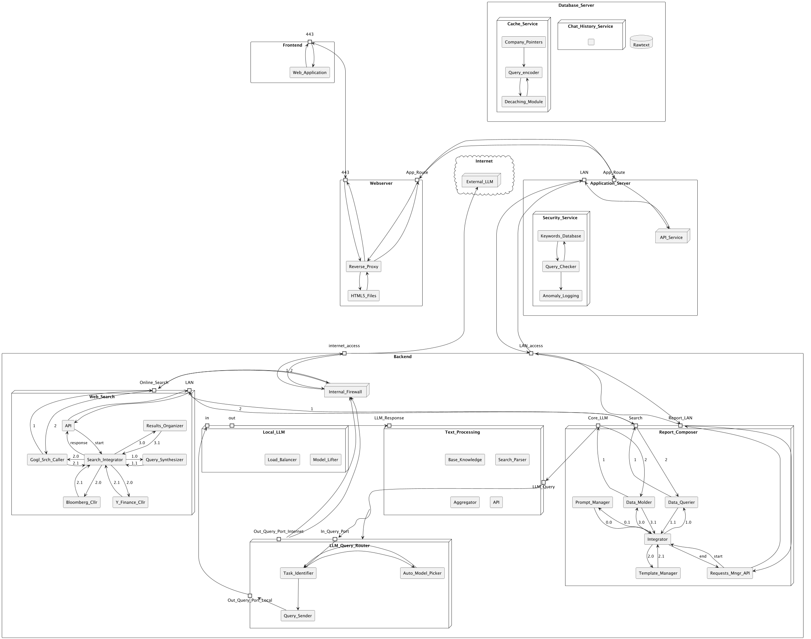

# Stratvithor
                - An AI-Powered Expanding Knowledge Ecosystem

Stratvithor redefines the way insights are gathered, structured, and continuously updated. It is a **multi-dimensional intelligence dashboard** that adapts in real time, integrating AI-driven automation with live data pipelines. Users can **design, explore, and refine structured knowledge environments**, ensuring that critical information remains current, relevant, and actionable.  

## **How Users Experience Stratvithor**  

Users interact with Stratvithor through a **highly intuitive, customizable interface** where they define the structure of their insights. Each **section** of the dashboard is a **dynamic knowledge module**, continuously updated with fresh data from AI-driven queries, live sources, and structured pipelines.  

- **Build & Customize:** Users start by defining key focus areas, shaping their dashboard to reflect their priorities. Whether tracking **financial markets, real-time traffic patterns, legislative changes, or developing weather systems**, Stratvithor structures the data according to their specifications.  
- **Live, Evolving Data Streams:** Each module is a **living entity**, not a static document. Sections update automatically based on real-time inputs, ensuring insights remain fresh and actionable. A dashboard monitoring **congressional law proposals** will stay updated as new bills are introduced, just as a **disaster response analyst** can track and adapt to live meteorological changes.  
- **Flexible Data Transformation:** Sections are not only **interconnected** but also **adaptable in form**. A module that **retrieves raw stock prices can output textual analysis**, while another that **processes legislative documents can generate numerical impact scores**. A section tracking **court rulings** can analyze the frequency of case outcomes and translate them into predictive legal trends. This seamless transformation of **data into meaning** allows users to shape their insights in ways that best serve their needs.  
- **Intelligent Relationships Between Sections:** Sections can be **linked** to inform each other. A traffic congestion monitoring module can adjust its predictions based on **weather conditions**, just as a **public policy tracker** can analyze **economic impacts** based on newly passed laws. This interconnectivity enables a **holistic view of complex information landscapes** where insights evolve together rather than in isolation.  
- **Interactive Exploration:** Users can **expand, refine, or eliminate** sections dynamically, controlling the depth and breadth of their insights. A journalist might start with a high-level summary of **emerging geopolitical conflicts** and then drill down into detailed reports, while an investor could refine a broad market outlook into sector-specific intelligence.  
- **Seamless Visualization:** Insights are not just presented as text but are enriched with **charts, time-series data, AI-generated summaries, and interactive visualizations**, allowing users to grasp complex information quickly and efficiently. A city planner can visualize **urban expansion trends**, while a climate researcher can monitor **long-term environmental changes**.  
- **AI-Assisted Adaptation:** Stratvithor continuously refines itself based on user interactions, learning which insights matter most and intelligently prioritizing relevant data. Whether tracking **court rulings, international trade developments, or breaking news**, the system ensures that users receive the most meaningful and up-to-date intelligence.  

## **A Continuous Intelligence Hub**  

By eliminating **information overload** and enabling real-time **knowledge expansion**, Stratvithor transforms traditional reporting into an **ongoing, interactive discovery process**. With its ability to dynamically **reshape information, link insights across modules, and refine knowledge structures**, Stratvithor ensures that every decision is backed by the most **current, relevant, and structured intelligence**—empowering users to stay ahead in a world where information never stops evolving.

---

## **Architecture**

### **System Components**

- **Backend**: Handles data querying, transformation, and integration, ensuring real-time updates and intelligent data flow.  
- **FrontEnd**: Provides an interactive **multi-dimensional dashboard** for exploring, customizing, and refining live knowledge modules.  
- **DataQuerier**: Executes asynchronous HTTP requests to APIs, validates structured responses, and ensures data integrity across interconnected sections.  
- **Integrator**: Implements the `generate_knowledge_module` method, executing prompts in **topological order** within the DAG. It processes queries, links interdependent sections, and integrates structured outputs into a **dynamic, live-updating knowledge system**.  
- **DataMolder**: Transforms raw queried data using an **AI-powered Text Processing microservice**, allowing seamless adaptation between **data formats** (e.g., numerical data into textual summaries, text-based insights into quantifiable metrics).  
- **Knowledge Modules (Formerly "Prompts")**: Defines structured, interrelated queries that shape the **dashboard layout** and guide how information evolves over time.  

### **Workflow**

1. **Topological Sorting of Knowledge Modules**: The DAG structures interdependencies between live data sections.  
2. **Real-Time Data Retrieval**: Each module asynchronously queries external sources, ensuring continuous updates.  
3. **Adaptive Data Transformation**: Retrieved data undergoes **context merging**, reshaping its form based on output needs (e.g., financial indicators generating textual market summaries or vice versa).  
4. **Dynamic Knowledge Integration**: The system assembles refined sections into a **live intelligence dashboard**, seamlessly blending data streams with visual and interactive elements.  
5. **User Interaction & Exploration**: The interface enables **hands-on navigation**, where users can **expand, refine, or restructure** their dashboard dynamically—adding new insights, filtering irrelevant data, and linking related topics into an evolving knowledge network.  

---

## **Key Features**  

✅ **Asynchronous Multi-Source Data Retrieval** - Efficient real-time API calls using `aiohttp`  
✅ **DAG-Based Dependency Management** - Ensures logical execution order and context-aware section updates  
✅ **Interactive & Configurable Knowledge Modules** - Users can shape, modify, and explore interconnected insights dynamically  
✅ **Live Data Processing & Transformation** - Uses `Text_Processing` for intelligent adaptation between **text, numbers, and structured outputs**  
✅ **Scalable & Modular** - Designed for adaptability across **finance, law, traffic analysis, weather monitoring, and more**  
✅ **AI-Powered Exploration** - Navigate the dashboard as an **expanding knowledge ecosystem**, linking relevant topics and pruning unnecessary details  
✅ **Multi-Modal Intelligence** - Supports **text, numerical insights, visualizations, time-series data, and interactive graphs** for a rich analytical experience  

Stratvithor transforms static reporting into an **ever-evolving intelligence network**, ensuring users have the most **current, relevant, and structured knowledge at their fingertips**.

---

## Deployment

The system is containerized using Docker for easy deployment. To run locally:

